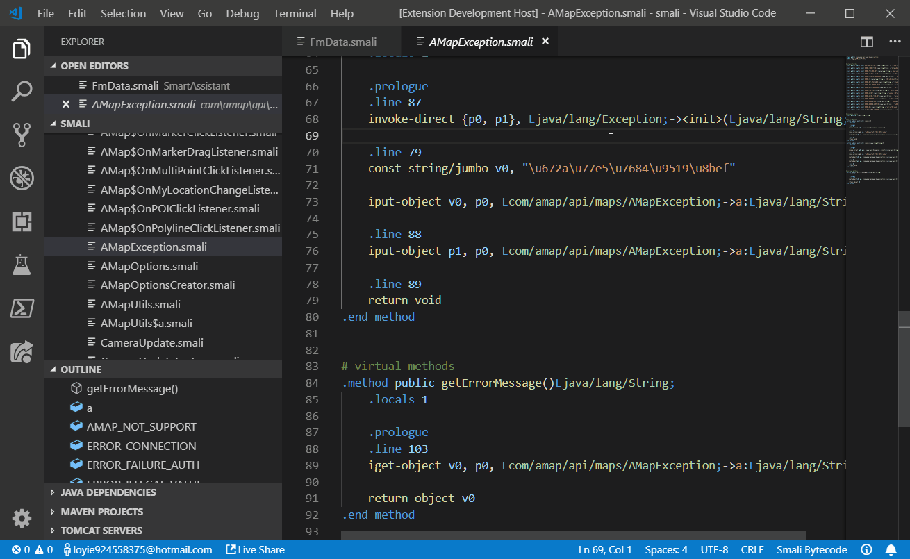
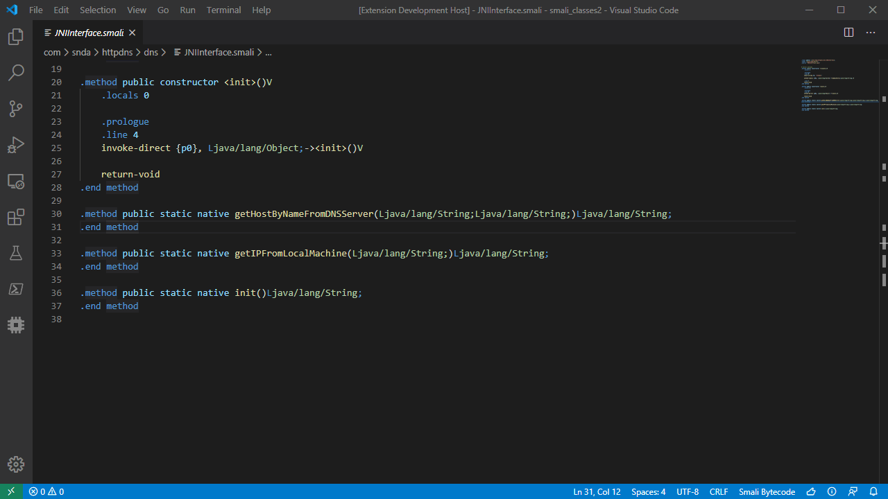

# Language Support for Smali(Android Davilk Bytecode)

## Features

* Syntax Highlighting

* Show Symbol Definitions

* Show Quick Info (Hover)

* Go To/Peek Definition

* Go To/Peek References

* Rename Symbol

**WARNING:** The Goto/Peek References and rename symbol function will immediately load all smali files into memory and take 20X memory to parse and store the metadata, so please use the function with caution.

## About

The syntax highlighting part is based on [smali-vscode](https://github.com/W-WTerDan/smali-vscode)

## Contact Me

Github: <https://github.com/LoyieKing/Smalise>

E-mail: loyieking@163.com

## Special Thanks

[@Gh0u1L5](https://github.com/Gh0u1L5)